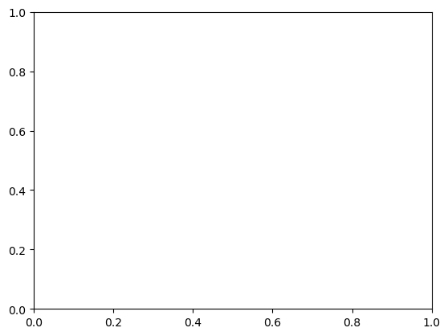
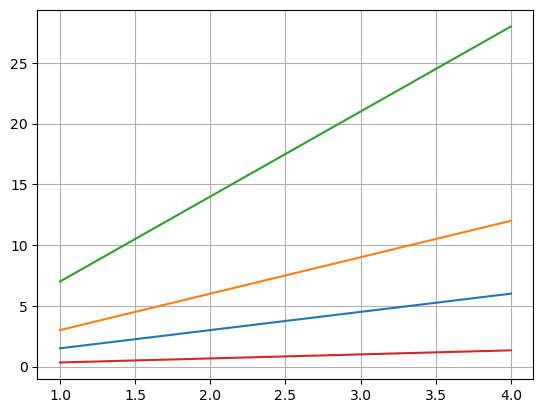
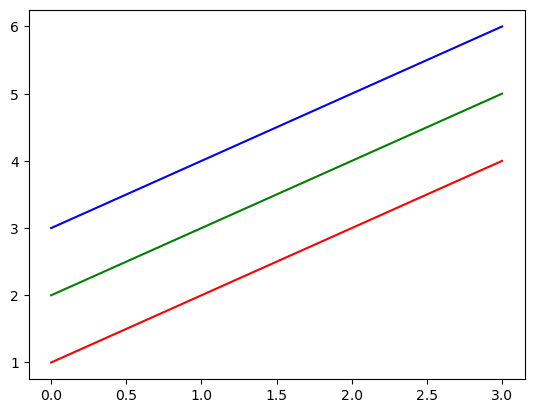

**Project Number: 06 #rohanwaghmare**

# Mastering Matplotlib

MATPLOTLIB = It is a popular data visualization library in Python


## Project Overview

This project is focused on mastering **Matplotlib**, the essential data visualization tool in Python. Matplotlib is widely used for creating static, animated, and interactive visualizations. Throughout this project, I will explore Matplotlib's object hierarchy, various plot types, and advanced customization techniques.ues.

### Key Topics Covered:

1. **Matplotlib Object Hierarchy** – Understanding the internal structure of how Matplotlib handles figures and plots.
2. **Types of Plots** – Covering a variety of plots like line plots, scatter plots, histograms, bar charts, and more.
3. **Customization Techniques** – Adjusting aspects like grid lines, axes, colors, line styles, and adding legends, titles, and labels.

This project is divided into multiple sections, starting with an introduction to Matplotlib and progressing into practical, hands-on examples with detailed theory. It will serve as a comprehensive guide to mastering data visualization using Matplotlib.

### Table of Contents:

1. Introduction  
2. Overview of Python Data Visualization Tools  
3. Introduction to Matplotlib  
4. Importing Matplotlib  
5. Displaying Plots  
6. Matplotlib Object Hierarchy  
7. Matplotlib Interfaces  
   - Pyplot API  
   - Object-Oriented API  
8. Figure and Subplots  
9. First Plot with Matplotlib  
10. Multiline Plots  
11. Parts of a Plot  
12. Saving the Plot  
13. Plot Types:  
    - Line Plot  
    - Scatter Plot  
    - Histogram  
    - Bar Chart  
    - Horizontal Bar Chart  
    - Error Bar Chart  
    - Stacked Bar Chart  
    - Pie Chart  
    - Box Plot  
    - Area Chart  
    - Contour Plot  
14. Styles with Matplotlib  
    - Adding a Grid  
    - Handling Axes  
    - Handling X and Y Ticks  
    - Adding Labels  
    - Adding a Title  
    - Adding a Legend  
    - Controlling Colors and Line Styles  
15. Summary

Stay tuned for detailed insights and practical demonstrations in each se.ion as I progress through mastering **Matplotlib**.
 as I progress through mastering **Matplotlib**.


## 1. Introduction

- When we want to convey information to others, there are several ways to do so. The process of conveying information with the help of plots and graphics is called **Data Visualization**. This technique takes numerical data as input and displays output in the form of charts, figures, and tables. Data visualization helps in analyzing and visualizing data clearly, enabling concrete decisions to be made. It transforms complex data into more accessible and understandable forms.

- The goal of data visualization is to communicate information in a clear and efficient manner.

- In this project, I will focus on **Matplotlib**, which is the basic data visualization tool in Python. Python offers various data visualization tools, each suitable for different purposes. I will first list these tools and then dive deeper into Matplotlib.


## 2. Overview of Python Data Visualization Tools
- 
Python is a popular language for data scientists because it has many options for creating visualizations. These tools help us understand and present data clearly. The most common Python tools for data visualization are:

- **Matplotlib**
- **Seaborn**
- **pandas**
- **Bokeh**
- **Plotly** (also used in R programming)
- **ggplot** (R propacpackageming tool)
- **pygal** (R prpacpackagemmi- ng tool)

In the next sections, I will focus on **Matplotlib** as the main tool for creating visualization
l in Python.


## 3. Introduction to Matplotlib

Matplotlib is the main plotting library in Python. It is one of the most important tools for creating visualizations. Matplotlib is very powerful and can handle many tasks. It can create high-quality images in different formats, like PDF, SVG, JPG, PNG, BMP, and GIF. You can make common plots like line plots, scatter plots, histograms, bar charts, error charts, pie charts, box plots, and even more. It also supports 3D plotting.

Many Python libraries are built on top of Matplotlib. For example, libraries like **pandas** and **Seaborn** use Matplotlib under the hood, making it easier to create plots with less code.

Matplotlib was created by John Hunter in 2002. It was originally made to visualize data from epilepsy patients in neurobiology research. Over time, it became the most popular plotting library in Python. For example, it was used for data visualization during the landing of the Phoenix spacecraft in 2008.


## 4. Import Matplotlib

- Before, we need to actually start using Matplotlib, we need to import it. We can import Matplotlib as follows:-

`import matplotlib`


- Most of the time, we have to work with **pyplot** interface of Matplotlib. So, I will import **pyplot** interface of Matplotlib as follows:-


`import matplotlib.pyplot`


- To make things even simpler, we will use standard shorthand for Matplotlib imports as follows:-


`import matplotlib.pyplot as plt`


- Now, whenever we use Matplotlib, we can just call it plt to keep the code shorter.


```python
import numpy as np  # Importing the NumPy library and giving it an alias 'np'. NumPy is used for numerical operations and handling arrays.
import pandas as pd  # Importing the Pandas library and giving it an alias 'pd'. Pandas is used for data manipulation and analysis, providing data structures like DataFrames.

```


```python
import matplotlib.pyplot as plt  # Importing the pyplot module from Matplotlib and giving it an alias 'plt'. Pyplot provides functions for creating static, animated, and interactive visualizations in Python.
```

# 5. Displaying Plots in Matplotlib

Viewing the Matplotlib plot is context-based. The best usage of Matplotlib differs depending on how we are using it. There are three applicable contexts for viewing the plots. The three applicable contexts are using plotting from a script, plotting from an IPython shell, or plotting from a Jupyter notebook.

## Plotting from a Script

If we are using Matplotlib from within a script, then the `plt.show()` command is of great use. It starts an event loop, looks for all currently active figure objects, and opens one or more interactive windows that display the figure or figures.

The `plt.show()` command should be used only once per Python session. It should be used only at the end of the script. Multiple `plt.show()` commands can lead to unpredictable results and should mostly be avoided.

## Plotting from an IPython Shell

We can use Matplotlib interactively within an IPython shell. IPython works well with Matplotlib if we specify Matplotlib mode. To enable this mode, we can use the `%matplotlib` magic command after starting IPython. Any `plt` plot command will cause a figure window to open and further commands can be run to update the plot.

## Plotting from a Jupyter Notebook

The Jupyter Notebook (formerly known as the IPython Notebook) is a data analysis and visualization tool that provides multiple tools under one roof. It provides code execution, graphical plots, rich text and media display, mathematics formula and much more facilities into a single executable document.

Interactive plotting within a Jupyter Notebook can be done with the `%matplotlib` command. There are two possible options to work with graphics in Jupyter Notebook. These are as follows:

- `%matplotlib notebook` – This command will produce interactive plots embedded within the notebook.

- `%matplotlib inline` – It will output static images of the plot embedded in the notebook.

After this command (it needs to be done only once per kernel per session), any cell within the notebook that creates a plot will embed a PNG image of the graphic.


To display plots inline within the Jupyter Notebook, use the `%matplotlib inline` magic command. This command ensures that plots are rendered as static images within the notebook.

## Example

Let's create a plot of sine and cosine functions.


```python
%matplotlib inline

x1 = np.linspace(0, 10, 100) # Generate data

fig = plt.figure() # Create a plot figure

# Plot sine and cosine functions
plt.plot(x1, np.sin(x1), '-')
plt.plot(x1, np.cos(x1), '--');
```


    

    


## 6. Matplotlib Object Hierarchy

In Matplotlib, a plot is organized into a hierarchy of nested Python objects. This hierarchical structure can be visualized as a tree where each object is a node.

At the top of this hierarchy is the **Figure** object, which serves as the outermost container for a Matplotlib plot. A **Figure** can contain one or more **Axes** objects. The **Axes** are the actual plotting areas within the figure and represent individual plots.

In simpler terms, think of the **Figure** object as a box that holds one or more **Axes**. Within each **Axes**, you’ll find elements such as tick marks, lines, legends, titles, and text boxes.


## 7. Matplotlib API Overview

Matplotlib provides two primary APIs for working with plots:

1. **Pyplot Interface**: This is a MATLAB-style state-based interface. It is designed to be similar to MATLAB's plotting commands and is often used for quick and simple plotting.

2. **Object-Oriented Interface**: This is a more powerful and flexible interface that allows for greater control over plot customization and management. It involves interacting with Matplotlib objects directly and is preferred for complex plots and applications.

There is also a third interface called the **Pylab Interface**, which merges `pyplot` (for plotting) and `NumPy` (for mathematical functions) into an environment similar to MATLAB. However, the use of `pylab` is considered bad practice today, so it is strongly discouraged. As such, it will not be covered further in this discussion.


## 7.1 Pyplot API 


**Matplotlib.pyplot** provides a MATLAB-style, procedural, state-machine interface to the underlying object-oriented library in Matplotlib. **Pyplot** is a collection of command style functions that make Matplotlib work like MATLAB. Each pyplot function makes some change to a figure - e.g., creates a figure, creates a plotting area in a figure etc. 


**Matplotlib.pyplot** is stateful because the underlying engine keeps track of the current figure and plotting area information and plotting functions change that information. To make it clearer, we did not use any object references during our plotting we just issued a pyplot command, and the changes appeared in the figure.


We can get a reference to the current figure and axes using the following commands-


`plt.gcf ( )`   # get current figure

`plt.gca ( )`   # get current axes 

 
**Matplotlib.pyplot** is a collection of commands and functions that make Matplotlib behave like MATLAB (for plotting). 
The MATLAB-style tools are contained in the pyplot (plt) interface. 

This is really helpful for interactive plotting, because we can issue a command and see the result immediately. But, it is not suitable for more complicated cases. For these cases, we have another interface called **Object-Oriented** interface, described later.


```python
# create a plot figure
plt.figure()


# create the first of two panels and set the current axis
plt.subplot(2, 1, 1) 
plt.plot(x1, np.sin(x1))

# create the second of two panels and set the current axis
plt.subplot(2, 1, 2)  
plt.plot(x1, np.cos(x1));
```


    

    


```python
print(plt.gcf()) # this print details about last figure
```

    Figure(640x480)
    


    <Figure size 640x480 with 0 Axes>


```python
print(plt.gca()) # this print axis details
```

    Axes(0.125,0.11;0.775x0.77)
    


    

    


## Visualization with Pyplot

- Generating visualization with Pyplot is effortless.
- The x-axis values range from 0-3 and the y-axis from 1-4.
- If we provide a single list or array to the plot() command, matplotlib assumes it is a sequence of y values, and automatically generates the x values.
- Since Python ranges start with 0, the default x vector has the same length as y but starts with 0. Hence the x data are [0,1,2,3] and y data are [1,2,3,4].


```python
plt.plot([1, 2, 3, 4]) # Plotting a simple line graph with y-values [1, 2, 3, 4] and default x-values [0, 1, 2, 3]
plt.ylabel('Numbers') # Labeling the y-axis as 'Numbers'
plt.show() # Displaying the plot
```


    

    


### plot()

**plot()** is a versatile command.
- It will take an arbitrary number of arguments. For example, to plot x versus y,
- We can issue the following command:-


```python
# Plotting a line graph with x-values [1, 2, 3, 4] and corresponding y-values [1, 4, 9, 16]
plt.plot([1, 2, 3, 4], [1, 4, 9, 16]) # This creates a quadratic curve

plt.show() # Displaying the plot
```


    

    


### State-Machine Interface

- Pyplot provides the state-machine interface to the underlying object-oriented plotting library.
- The state machine implicitly and automatically creates figures and axes to achieve the desired plot.
- For example:


```python
# Generating 100 linearly spaced values between 0 and 2
x = np.linspace(0, 2, 10)


plt.plot(x, x, label='Linear') # Plotting the linear function y = x with a label 'linear'
plt.plot(x, x**2, label='Quadratic') # Plotting the quadratic function y = x^2 with a label 'quadratic'
plt.plot(x, x**3, label='Cubic') # Plotting the cubic function y = x^3 with a label 'cubic'


plt.xlabel('X Label') # Labeling the x-axis as 'x label'
plt.ylabel('Y Label') # Labeling the y-axis as 'y label'


plt.title("Simple Plot #ROHAN") # Setting the title of the plot to "Simple Plot"
plt.legend() # Adding a legend to the plot to differentiate between the lines

plt.show() # Displaying the plot
```


    

    


### Formatting the style of the plot

- For every x, y pair of arguments, there is an optional third argument which is the format string that indicates the color and line type of the plot.
- The letters and symbols of the format string are from MATLAB.
- We can concatenate a color string with a line-style string. 
- The default format string is 'b-', which is a solid blue line.
- For example, to plot the above line with red circles, we would issue the following command:-


```python
# The x-values are [1, 2, 3, 4, 5] and the corresponding y-values are [2, 4, 6, 8, 10]
plt.plot([1, 2, 3, 4, 5], [2, 4, 6, 8, 10], 'ro')  # here r = red color plot & o = circle markers

# Setting the limits for the x-axis and y-axis
# x-axis ranges from 0 to 6
# y-axis ranges from 0 to 12
plt.axis([0, 6, 0, 12])

plt.show()
```


    

    


The **axis()** command in the example above takes a list of [xmin, xmax, ymin, ymax] and specifies the viewport of the axes.

### Working with NumPy arrays

- Generally, we have to work with NumPy arrays.
- All sequences are converted to numpy arrays internally.
- The below example illustrates plotting several lines with different format styles in one command using arrays:


```python
# evenly sampled time at 200ms intervals
rohn = np.arange(0., 5., 0.2)

# red dashes, blue squares and green triangles
plt.plot(rohn, rohn, 'r--', rohn, rohn**2, 'bs', rohn, rohn**3, 'g^')

plt.show()
```


    

    


## 7.2	Object-Oriented API

The **Object-Oriented API** is available for more complex plotting situations. It allows us to exercise more control over the figure. In Pyplot API, we depend on some notion of an "active" figure or axes. But, in the **Object-Oriented API** the plotting functions are methods of explicit Figure and Axes objects.


**Figure** is the top level container for all the plot elements. We can think of the **Figure** object as a box-like container containing one or more **Axes**. 


The **Axes** represent an individual plot. The **Axes** object contain smaller objects such as axis, tick marks, lines, legends, title and text-boxes.

The following code produces sine and cosine curves using Object-Oriented API:


```python
# First create a grid of plots
# ax will be an array of two Axes objects
fig, ax = plt.subplots(2)


# Call plot() method on the appropriate object
ax[0].plot(x1, np.sin(x1), 'b-')
ax[1].plot(x1, np.cos(x1), 'b-');
```


    

    


### Objects and Reference

- The main idea with the **Object Oriented API** is to have objects that one can apply functions and actions on. The real advantage of this approach becomes apparent when more than one figure is created or when a figure contains more than one 
subplot.
- We create a reference to the figure instance in the **fig** variable. Then, we ceate a new axis instance **axes** using the 
**add_axes** method in the Figure class instance fig as follows:-


```python
rohn = plt.figure()

X = np.linspace(0, 5, 10)
Y = X ** 2

axes = rohn.add_axes([0.1, 0.1, 0.8, 0.8])

axes.plot(X, Y, 'b')

axes.set_xlabel('X')
axes.set_ylabel('Y')
axes.set_title('India Economy');
```


    

    


### Figure and Axes


- I start by creating a figure and an axes. A figure and axes can be created as follows:


`fig = plt.figure()`

`ax = plt.axes()`


- In Matplotlib, the **figure** (an instance of the class plt.Figure) is a single container that contains all the objects representing axes, graphics, text and labels. The **axes** (an instance of the class plt.Axes) is a bounding box with 
ticks and labels. It will contain the plot elements that make up the visualization. I have used the variable name fig 
to refer to a figure instance, and ax to refer to an axes instance or group of axes instances.


```python
fig = plt.figure()

ax = plt.axes()
```


    

    


```python
fig = plt.figure()
```


    <Figure size 640x480 with 0 Axes>


## 8. Figure and Subplots


- Plots in Matplotlib reside within a Figure object. As described earlier, we can create a new figure with plt.figure() 
as follows:-


`fig = plt.figure()`


- Now, I create one or more subplots using fig.add_subplot() as follows:-


`ax1 = fig.add_subplot(2, 2, 1)`


- The above command means that there are four plots in total (2 * 2 = 4). I select the first of four subplots (numbered from 1).


- I create the next three subplots using the fig.add_subplot() commands as follows:-


`ax2 = fig.add_subplot(2, 2, 2)`

`ax3 = fig.add_subplot(2, 2, 3)`

`ax4 = fig.add_subplot(2, 2, 4)`


```python
fig = plt.figure()

# Add subplots
ax1 = fig.add_subplot(2, 2, 1)
ax2 = fig.add_subplot(2, 2, 2)
ax3 = fig.add_subplot(2, 2, 3)
ax4 = fig.add_subplot(2, 2, 4)

# Set titles for each subplot
ax1.set_title('subplot 221')
ax2.set_title('subplot 222')
ax3.set_title('subplot 223')
ax4.set_title('subplot 224')

plt.tight_layout(rect=[0, 0, 1, 0.93])  # Adjust the rect parameter to fit the subtitles

plt.show()
```


    

    


## 9. First plot with Matplotlib


- Now, I will start producing plots.
- Here is the first example:-


```python
plt.plot([1, 3, 2, 4], 'b-')

plt.show( )
```


    

    


`plt.plot([1, 3, 2, 4], 'b-')`

- This code line is the actual plotting command.
- Only a list of values has been plotted that represent the vertical coordinates of the points to be plotted.
- Matplotlib will use an implicit horizontal values list, from 0 (the first value) to N-1 (where N is the number of items in the list).

### Specify both Lists


Also, we can explicitly specify both the lists as follows:- 


`X = range(10)`


`plt.plot(X, [xi**2 for xi in X])` 


`plt.show()`


```python
X = np.arange(0.0, 10.0, 0.01) 

plt.plot(X, [xi**2 for xi in X], 'g-') 

plt.show()
```


    

    


## 10.	Multiline Plots

- Multiline Plots mean plotting more than one plot on the same figure.
- We can plot more than one plot on the same figure.
- It can be achieved by plotting all the lines before calling show().
- It can be done as follows:-


```python
X = range(1, 5)

plt.plot(X, [xi*1.5 for xi in X])

plt.plot(X, [xi*3 for xi in X])

plt.plot(X, [xi*7 for xi in X])

plt.plot(X, [xi*9 for xi in X])

plt.plot(X, [xi/3.0 for xi in X])

plt.show()
```


    

    


## 11.	Parts of a Plot


- There are different parts of a plot.
- These are title, legend, grid, axis and labels, etc.


## 12.	Saving the Plot


- We can save the figures in a wide variety of formats. We can save them using the **savefig()** command as follows:-


`fig.savefig(‘fig1.png’)`


- We can explore the contents of the file using the IPython **Image** object.


`from IPython.display import Image`


`Image(‘fig1.png’)`


- In **savefig()** command, the file format is inferred from the extension of the given filename. Depending on the backend, 
many different file formats are available. The list of supported file types can be found by using the get_supported_filetypes() method of the figure canvas object as follows:-


`fig.canvas.get_supported_filetypes()` 


```python
fig.savefig('plot1.png') # Saving the figure
```


```python
from IPython.display import Image

Image('plot1.png')
```


    

    


```python
fig.canvas.get_supported_filetypes() # Explore supported file formats
```


    {'eps': 'Encapsulated Postscript',
     'jpg': 'Joint Photographic Experts Group',
     'jpeg': 'Joint Photographic Experts Group',
     'pdf': 'Portable Document Format',
     'pgf': 'PGF code for LaTeX',
     'png': 'Portable Network Graphics',
     'ps': 'Postscript',
     'raw': 'Raw RGBA bitmap',
     'rgba': 'Raw RGBA bitmap',
     'svg': 'Scalable Vector Graphics',
     'svgz': 'Scalable Vector Graphics',
     'tif': 'Tagged Image File Format',
     'tiff': 'Tagged Image File Format',
     'webp': 'WebP Image Format'}


## 13. Plot Types

## 13.1.	Line Plot


- We can use the following commands to draw the simple sinusoid line plot:-


```python
fig = plt.figure() # Create figure and axes first

ax = plt.axes()

X = np.linspace(0, 10, 1000) # Declare a variable x5

ax.plot(X, np.sin(X), 'r-'); # Plot the sinusoid function
```


    

    


## 13.2.	Scatter Plot

- Another commonly used plot type is the scatter plot. Here the points are represented individually with a dot or a circle.
- Scatter Plot with plt.plot() = We have used plt.plot/ax.plot to produce line plots.
- We can use the same functions to produce the scatter plots as follows:-


```python
X = np.linspace(0, 10, 30)

Y = np.sin(X)

plt.plot(X, Y, 'o', color = 'red');
```


    

    


## 13.3.	Histogram


- Histogram charts are a graphical display of frequencies.
- They are represented as bars.
- They show what portion of the dataset falls into each category, usually specified as non-overlapping intervals.
- These categories are called bins.
- The **plt.hist()** function can be used to plot a simple histogram as follows:-


```python
histo = np.random.randn(1000)

plt.hist(histo, color = 'red'); 
```


    

    


## 13.4.	Bar Chart


- Bar charts display rectangular bars either in vertical or horizontal form.
- Their length is proportional to the values they represent.
- They are used to compare two or more values.
- We can plot a bar chart using plt.bar() function. We can plot a bar chart as follows:-


```python
bar1 = [5. , 25. , 50. , 20.]

plt.bar(range(len(bar1)), bar1, color = 'red')

plt.show()
```


    

    


## 13.5.	Horizontal Bar Chart


- We can produce a Horizontal Bar Chart using the plt.barh() function.
- It is the strict equivalent of plt.bar() function.


```python
hori1 = [5. , 25. , 50. , 20.]

plt.barh(range(len(hori1)), hori1, color = 'red')

plt.show() 

```


    

    


## 13.6.	Error Bar Chart


- In experimental design, the measurements lack perfect precision.
- So, we have to repeat the measurements.
- It results in obtaining a set of values.
- The representation of the distribution of data values is done by plotting a single data point (known as a mean value of the dataset) and an error bar to represent the overall distribution of data.
- We can use Matplotlib's **errorbar()** function to represent the distribution of data values. It can be done as follows:-


```python
X = np.arange(0, 4, 0.2)

Y = np.exp(-X)

Z = 0.1 * np.abs(np.random.randn(len(Y)))

plt.errorbar(X, Y, yerr = Z, fmt = '.-', color = 'red')

plt.show();
```


    

    


## 13.7. Stacked Bar Chart


- We can draw a stacked bar chart by using a special parameter called **bottom** from the plt.bar() function.
- It can be done as follows:- 


```python
X = [15., 30., 45., 22.]

Y = [15., 25., 50., 20.]

Z = range(4)

plt.bar(Z, X, color = 'red')
plt.bar(Z, Y, color = 'black', bottom = X)

plt.show()
```


    

    


The bottom option in the plt.bar() function lets us choose where the bar starts. Normally, bars start at zero and go up to a certain value, but with bottom, we can make them start higher, at any position we want. In this case, the first set of bars (blue) starts at zero, and the second set of bars (red) starts at the top of the blue bars.

## 13.8. Pie Chart


- Pie charts are circular representations, divided into sectors.
- The sectors are also called **wedges**.
- The arc length of each sector is proportional to the quantity we are describing.
- It is an effective way to represent information when we are interested mainly in comparing the wedge against the whole pie, instead of wedges against each other.
- Matplotlib provides the **pie()** function to plot pie charts from an array X. Wedges are created proportionally so that each value x of array X generates a wedge proportional to x/sum(X).


```python
plt.figure(figsize=(7,7))

X = [50, 25, 20, 20]

labels = ['Mangoes', 'Oranges', 'Strawberry', 'Dragon Fruit']

plt.pie(X, labels=labels);

plt.show()
```


    

    


## 13.9. Box Plot


- Boxplot allows us to compare distributions of values by showing the median, quartiles, maximum and minimum of a set of values.
- We can plot a boxplot with the **boxplot()** function as follows:-


```python
box1 = np.random.randn(100)

plt.boxplot(box1)

plt.show();
```


    

    


The **boxplot()** function takes a set of values and computes the mean, median, and other statistical quantities. The following points describe the preceding boxplot:


- The red bar is the median of the distribution.
- The blue box includes 50 percent of the data from the lower quartile to the upper quartile. Thus, the box is centered on the median of the data.
- The lower whisker extends to the lowest value within 1.5 IQR from the lower quartile.
- The upper whisker extends to the highest value within 1.5 IQR from the upper quartile.
- Values further from the whiskers are shown with a cross marker.

## 13.10. Area Chart


- An **Area Chart** is very similar to a **Line Chart**.
- The area between the x-axis and the line is filled in with color or shading.
- It represents the evolution of a numerical variable following another numerical variable.
- We can create an Area Chart as follows:-


```python
# Create some data
X = range(1, 6)
Y = [1, 4, 6, 8, 4]

# Area plot
plt.fill_between(X, Y, color = 'black')

plt.show()
```


    

    


- I have created a basic Area chart. I could also use the stack plot function to create the Area chart as follows:-

`plt.stackplot(x12, y12)`

- The fill_between() function is more convenient for future customization.


## 13.11. Contour Plot


- **Contour plots** are useful to display three-dimensional data in two dimensions using contours or color-coded regions.
- **Contour lines** are also known as **level lines** or **isolines**.
- **Contour lines** for a function of two variables are curves where the function has constant values.
- They have specific names beginning with iso- according to the nature of the variables being mapped.
- There are a lot of applications of **Contour lines** in several fields such as meteorology(for temperature, pressure, rain, and wind speed), geography, magnetism, engineering, social sciences and so on.
- The density of the lines indicates the **slope** of the function. The **gradient** of the function is always perpendicular to the contour lines.
- When the lines are close together, the length of the gradient is large and the variation is steep.
- A **Contour plot** can be created with the **plt.contour()** function as follows:-


```python
# Create a matrix
con1 = np.random.rand(10, 20)

cp = plt.contour(con1)

plt.show()
```


    

    


- The **contour()** function draws contour lines. It takes a 2D array as input.Here, it is a matrix of 10 x 20 random elements.

- The number of level lines to draw is chosen automatically, but we can also specify it as an additional parameter, N.

`plt.contour(matrix, N)`

## 14. Styles with Matplotlib


- The Matplotlib version 1.4 which was released in August 2014 added a very convenient `style` module.
- It includes a number of new default stylesheets, as well as the ability to create and package own styles.
- We can view the list of all available styles by the following command.

`print(plt.style.availabe)`


```python
print(plt.style.available) # View list of all available styles
```

    ['Solarize_Light2', '_classic_test_patch', '_mpl-gallery', '_mpl-gallery-nogrid', 'bmh', 'classic', 'dark_background', 'fast', 'fivethirtyeight', 'ggplot', 'grayscale', 'seaborn-v0_8', 'seaborn-v0_8-bright', 'seaborn-v0_8-colorblind', 'seaborn-v0_8-dark', 'seaborn-v0_8-dark-palette', 'seaborn-v0_8-darkgrid', 'seaborn-v0_8-deep', 'seaborn-v0_8-muted', 'seaborn-v0_8-notebook', 'seaborn-v0_8-paper', 'seaborn-v0_8-pastel', 'seaborn-v0_8-poster', 'seaborn-v0_8-talk', 'seaborn-v0_8-ticks', 'seaborn-v0_8-white', 'seaborn-v0_8-whitegrid', 'tableau-colorblind10']
    

We can set the **Styles** for Matplotlib plots as follows:-


`plt.style.use('seaborn-bright')`

## 14.1. Adding a grid


- In some cases, the background of a plot was completely blank.
- We can get more information, if there is a reference system in the plot.
- The reference system would improve the comprehension of the plot.
- An example of the reference system is adding a **grid**.
- We can add a grid to the plot by calling the **grid()** function.
- It takes one parameter, a Boolean value, to enable(if True) or disable(if False) the grid.


```python
X = np.arange(1, 5)

plt.plot(X, X*1.5, X, X*3.0, X, X*7.0, X, X/3.0)

plt.grid(True)

plt.show()
```


    

    


## 14.2. Handling axes


- Matplotlib automatically sets the limits of the plot to precisely contain the plotted datasets.
- Sometimes, we want to set the axes limits ourselves.
- We can set the axes limits with the **axis()** function as follows:-


```python
X = np.arange(1, 5)

plt.plot(X, X*1.5, X, X*3.0, X, X*2.0, X, X/3.0)

plt.axis()   # shows the current axis limits values

plt.axis([0, 5, -1, 13])

plt.show()
```


    

    


- We can see that we now have more space around the lines.
- If we execute **axis()** without parameters, it returns the actual axis limits.
- We can set parameters to **axis()** by a list of four values.
- The list of four values are the keyword arguments [xmin, xmax, ymin, ymax] allows the minimum and maximum limits for X and Y 
axis respectively.
- We can control the limits for each axis separately using the `xlim()` and `ylim()` functions. This can be done as follows:-


```python
X = np.arange(1, 5)

plt.plot(X, X*1.5, X, X*3.0, X, X/3.0)

plt.xlim([1.0, 4.0])

plt.ylim([0.0, 12.0])
```


    (0.0, 12.0)


    

    


## 14.3. Handling X and Y ticks


- Vertical and horizontal ticks are those little segments on the axes, coupled with axes labels, used to give a reference system
on the graph.So, they form the origin and the grid lines.
-  Matplotlib provides two basic functions to manage them - **xticks()** and **yticks()**.
-  Executing with no arguments, the tick function returns the current ticks' locations and the labels corresponding to each of them.
-  We can pass arguments(in the form of lists) to the ticks functions. The arguments are:-

1. Locations of the ticks

2. Labels to draw at these locations.

- We can demonstrate the usage of the ticks functions in the code snippet below:-


```python
X = [5, 4, 9, 7, 8, 9, 6, 5, 7, 8]

plt.plot(X, color = "Black")

plt.xticks([2, 4, 6, 8, 10])
plt.yticks([2, 4, 6, 8, 10])

plt.show()
```


    

    


## 14.4. Adding labels


- Another important piece of information to add to a plot is the axes labels since they specify the type of data we are plotting.


```python
plt.plot([1, 3, 2, 4], color = "Black")

plt.xlabel('This is the X axis') 

plt.ylabel('This is the Y axis')

plt.show()
```


    

    


## 14.5. Adding a title


- The title of a plot describes the plot.
-  Matplotlib provides a simple function **title()** to add a title to an image.  


```python
plt.plot([1, 3, 2, 4], color = "Black")

plt.title('This Called TITLE')

plt.show()
```


    

    


- The above plot displays the output of the previous code. The title  "This Called TITLE"  is displayed on top of the plot.

## 14.6. Adding a legend


- Legends are used to describe what each line or curve means in the plot.
- Legends for curves in a figure can be added in two ways.
- One method is to use the **legend** method of the axis object and pass a list/tuple of legend texts as follows:-


```python
X = np.arange(1, 5)

fig, ax = plt.subplots()

ax.plot(X, X*1.5)
ax.plot(X, X*3.0)
ax.plot(X, X/3.0)

ax.legend(['Legend 1','Legend 2','Legend 3']);
```


    

    


- The above method follows the MATLAB API. It is prone to errors and unflexible if curves are added to or removed from the plot.
It resulted in a wrongly labeled curve.
- A better method is to use the **label** keyword argument when plots are added to the figure. Then we use the **legend** method without arguments to add the legend to the figure.
- The advantage of this method is that if curves are added or removed from the figure, the legend is automatically updated
accordingly.
- It can be achieved by executing the code below:-


```python
X = np.arange(1, 5)

fig, ax = plt.subplots()

ax.plot(X, X*1.5, label='Normal')
ax.plot(X, X*3.0, label='Fast')
ax.plot(X, X/3.0, label='Slow')

ax.legend();
```


    

    


- The **legend** function takes an optional keyword argument **loc**. It specifies the location of the legend to be drawn. 
- The **loc** takes numerical codes for the various places the legend can be drawn.
- The most common **loc** values are as follows:-
  
1. ax.legend(loc=0)  # let Matplotlib decide the optimal location
2. ax.legend(loc=1)  # upper right corner
3. ax.legend(loc=2)  # upper left corner
4. ax.legend(loc=3)  # lower left corner
5. ax.legend(loc=4)  # lower right corner
6. ax.legend(loc=5)  # right
7. ax.legend(loc=6)  # center left
8. ax.legend(loc=7)  # center right
9. ax.legend(loc=8)  # lower center
10. ax.legend(loc=9)  # upper center
11. ax.legend(loc=10) # center

## 14.7. Control colours


- We can draw different lines or curves in a plot with different colors.
- In the code below, we specify color as the last argument to draw red, blue, and green lines.


```python
X = np.arange(1, 5)

plt.plot(X, 'r')
plt.plot(X+1, 'g')
plt.plot(X+2, 'b')

plt.show()
```


    

    


- The colour names and colour abbreviations are given in the following table:-


**Colour abbreviation**      **Colour name**

b                               (blue)

c                               (cyan)

g                               (green)

k                               (black)

m                               (magenta)

r                               (red)

w                               (white)

y                               (yellow)

- There are several ways to specify colors, other than by color abbreviations:
    
•	The full-colour name, such as yellow

•	Hexadecimal string such as ##FF00FF

•	RGB tuples, for example (1, 0, 1)

•	Grayscale intensity, in string format such as ‘0.7’.

## 14.8. Control line styles


- Matplotlib provides us with different line style options to draw curves or plots.
- In the code below, I use different line styles to draw different plots.


```python
X = np.arange(1, 5)

plt.plot(X, '--', X+1, '-.', X+2, ':')

plt.show()
```


    

    


The above code snippet generates a blue dashed line, a green dash-dotted line and a red dotted line.

- All the available line styles are available in the following table:


**Style abbreviation**  **Style**

-                    (solid line)
   
--                   (dashed line)
   
-.                   (dash-dot line)
   
:                    (dotted line)
   


- Now, we can see the default format string for a single line plot is 'b-'.

## 15. Summary

In this project, I discuss Matplotlib (the basic plotting library in Python) and throw some light on various charts and customization techniques associated with it.


In particular, I discuss Matplotlib object hierarchy, Matplotlib architecture, Pyplot, and Object-Oriented architecture. I also discuss subplots which is very important tool to create graphics in Matplotlib.


Then, I discuss various types of plots like line plots, scatter plots, histograms, bar charts, pie charts, box plots, area charts, and contour plots. 


Finally, I discuss various customization techniques. I discuss how to customize the graphics with styles. I discuss how to add a grid and how to handle axes and ticks. I discuss how to add labels, titles, and legends. I discuss how to customize the charts with colors and line styles.


[Go to Top](#0)

# Thanks for visiting here #rohanwaghmare
